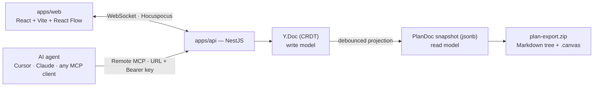

<div align="center">

# Schematic Planner

**Plan in the browser. Own the output.**

Turn a software idea into a visual plan graph — features, tasks and decisions on a
canvas — then take it with you as a plain Markdown tree and an Obsidian Canvas file.

[](./LICENSE)
[](#project-status)


</div>

---

## Table of contents

- [What this is](#what-this-is)
- [Who it is for](#who-it-is-for)
- [How it works](#how-it-works)
- [The data model](#the-data-model)
- [The MCP surface](#the-mcp-surface)
- [The export format](#the-export-format)
- [Repository layout](#repository-layout)
- [Where new code goes](#where-new-code-goes)
- [Performance notes](#performance-notes)
- [How it is drawn](#how-it-is-drawn)
- [Getting started](#getting-started)
- [Conventions](#conventions)
- [Project status](#project-status)
- [Roadmap](#roadmap)
- [Non-goals](#non-goals)
- [Contributing](#contributing)
- [License](#license)

---

## What this is

AI coding agents are good at writing code and good at writing plans. They are bad at
holding a plan still. Ask one to build a feature and it will happily produce a
plausible task list, lose half of it three messages later, and reinvent the
architecture on the next run.

Schematic Planner is the step _before_ the code. It gives a plan a **shape** — a graph
of features, tasks and decisions laid out on a coordinate plane — so that both the
human and the agent are looking at the same artifact. When the shape is agreed, the
plan leaves as files you can commit next to your source.

Two properties define the product:

1. **The output is yours.** Every plan exports to a directory tree of Markdown files
   plus an Obsidian Canvas, in a single zip. Nothing about the format needs this
   service to be readable. If we disappear, your plans still open.
2. **The whole server is yours if you want it.** The stack is AGPL-3.0 and runs from
   one Docker Compose file. No proprietary auth service, no managed-only dependency.

## Who it is for

| Audience                                          | What they get                                                                  |
| ------------------------------------------------- | ------------------------------------------------------------------------------ |
| Solo developers doing AI-assisted ("vibe") coding | A durable plan an agent can read on every run instead of re-deriving it        |
| Small product teams                               | A shared canvas for scoping, with real-time co-editing and share links         |
| Obsidian / plain-text users                       | Plans that land in the vault as Markdown and Canvas, not in someone's database |
| Companies with source-code policies               | A self-hostable instance behind their own network boundary                     |

## How it works

The web app and AI agents are **peer clients of the same document**. An agent adding a
task through MCP and a human dragging a node in the browser are writing to the same
place, at the same time, and both see the result immediately.



`apps/www` (Next.js) sits beside all of this and serves the landing page, docs, guides
and legal pages — everything that needs to be indexed by a search engine, and nothing
that needs to be interactive.

## The data model

This is the single most important thing to understand about the codebase.

Real-time collaboration and agent-driven writes cannot share one representation, so
there are two, and the direction between them never reverses:

```
Y.Doc (Yjs CRDT, stored as bytea)   ← the WRITE model.
                                      Human drags and MCP calls both land here.
        │  debounced projection
        ▼
PlanDoc snapshot (jsonb)            ← the READ model.
                                      Lists, search, share pages and export read this.
```

**Rules that follow from this, and must not be broken:**

- `packages/ydoc` is shared by `apps/web` and `apps/api`. Both sides bind the same
  document shape from the same code. If either side reimplements the shape, they will
  drift and corrupt documents.
- Nodes and edges live in **`Y.Map` keyed by id**, never in `Y.Array`. React Flow
  reorders its arrays freely; putting that on an array CRDT produces duplicates and
  lost nodes under concurrent editing.
- The snapshot is derived. Nothing writes to it directly. If you find yourself
  patching `jsonb`, you are in the wrong layer.
- Sync is served by **Hocuspocus embedded in the NestJS process** — same auth, same
  permissions, one container. Splitting it out is a scaling decision to make when load
  actually shows it, not before.

### Where things live

```
Workspace            people, roles, invitations, and the API keys agents connect with
  └─ Project         one thing being built
       └─ Folder     optional: a drawer inside the project
            └─ Plan  one graph
```

Folders do not nest, and a plan does not have to be in one — `folderId` is null
for every plan at a project's own top level, which is where they all were before
folders existed. Two levels of grouping is what a project of a few dozen plans
needs; each level past that multiplies the places a plan can be hiding without
adding a way to find it.

A folder is a place in both screens that list plans. In the rail beside the
canvas it opens and closes in line, and a plan is dragged from one drawer to
another. On the project index it is a row like any other — its name, how many
plans it holds, when it last changed — and clicking it goes into a screen of that
folder's own, at `project/<slug>/folder/<id>`, which is an address that can be
handed to somebody. A plan is filed from the row menu on either screen.

A workspace and a project are addressed by a readable slug; a plan is not, and
sits at the top level:

```
/recent                            what you have worked on lately, across every workspace
/workspace/acme                    projects
/workspace/acme/project/billing    plans
/workspace/acme/members  /settings  /trash
/plan/:planId                      the canvas
/share/:token                      read only, no session
/settings  /settings/agents        your account, and the keys your agents hold
```

The application opens on `/recent` rather than on a workspace: people come back to a
plan, and rarely remember which workspace it was filed under. Your account and
your agent keys are not part of any workspace either, so they live behind the
account row at the foot of the rail instead of in it.

A plan link is the thing people paste to each other, so it stays flat: renaming
a workspace or a project must not break a link somebody saved. The cost is that
the canvas cannot tell where it sits from its own address, so it asks —
`GET /plans/:id/navigation` returns the workspace tree around a plan, names
only, and the canvas draws it as the rail you move between plans with.

### Deleting, and the trash

Deleting a plan or a project sets `deletedAt` and nothing more. Every listing
filters on `deletedAt IS NULL` — `AccessService` treats a trashed row as missing
unless the caller passes `includeTrashed`, which only the trash itself does — so
one flag is enough and no query has to remember a second table.

A trashed project takes its plans with it without marking them: their own
`deletedAt` stays clear, so restoring the project brings back exactly what was
under it and not the plans somebody had already thrown away. A folder behaves the
same way, so every listing has to ask about the folder as well as the plan.
Nothing leaves the trash on its own; removing a row for good is a separate call,
and emptying the trash is the only thing that deletes in bulk. Destroying a
folder for good is the one case that destroys nothing else: its plans fall back
to the project's top level rather than going with it.

An invitation to a workspace can be listed and withdrawn — `GET` and `DELETE` on
`workspaces/:id/invites`, both ADMIN. Only the ones that would still let
somebody in are listed, following the instance's own invitation screen: a list
of links that no longer work is a list nobody can act on. Withdrawing removes
the row, because a single-use link that was taken back before it was used has
nothing left to say. An invitation may not carry a role above the one its issuer
holds.

A share link outlives the trash, because the trash is reversible and a fresh
token would not be the link people have already pasted around. That makes the
trash the only screen the link can be turned off from — every other route to
"stop sharing" runs through a plan page that reports a trashed plan as missing —
so the trash marks which plans are still answering one, and offers the action
there.

### Plan vocabulary

`packages/schema` is the plan domain: the zod schemas every app imports, the graph
primitives built on them (containment tree, topological order, cycle detection),
the repair pass that turns arbitrary CRDT state back into a valid document, and
the pure reference implementation of the write path. A `PlanDoc` is:

- **nodes** — `feature`, `task`, `decision`, `note`, `group`. Each has a human-readable
  `slug`, a title, Markdown `body`, `status`, and an optional pinned `position`. The
  slug is derived from the title when the node is made and can be changed after,
  through `rename_node` — which moves every edge, note anchor and containment
  pointing at it in the same transaction, since edge identity is derived from the
  endpoints. It matters because the slug is both the address an agent calls a node
  by and the name of the file it exports to, so a node whose title had moved on used
  to carry a name from its first minute in both places. A rename is recognised in the
  history rather than read as a deletion and an unrelated arrival.
- **edges** — `contains` (nesting; becomes directory structure on export),
  `depends_on` (ordering; becomes file numbering on export), and `relates_to`
  (association with no structural meaning).
- **comments** — notes left _on_ the drawing rather than in it. A node says what
  the system is; a comment says what somebody thinks about it. They are keyed by
  a readable id the author chooses, carry a position of their own, and may be
  anchored to a node or float free. Deleting the node they were about unanchors
  them rather than deleting them: an objection should not disappear along with
  the box it was raised against.

Comments are in the document rather than in a table, which is what makes them
worth having. They appear on every open canvas the moment they are written, they
come back through `get_plan`, and an agent asked to carry on with a plan reads
the open objections before it starts. The cost is that `author` is self-reported
like any other field — real attribution comes from the history, which is derived
on the server from the difference between two versions.

Edge identity is derived from its endpoints rather than generated, so submitting
the same relationship twice collapses to one edge instead of duplicating it. That
is what makes an agent's retry safe.

## The MCP surface

Agents are a first-class client, so the tool surface is designed around what an LLM is
actually good at. Three principles drive it:

**1. The agent never computes coordinates.** It declares structure; the server runs
ELK.js layout. A node without a `position` gets placed. A node a human has dragged is
`pinned` and auto-layout leaves it alone forever after.

**2. The agent speaks in slugs.** `auth-service`, not a UUID. An agent can create a
node and reference it in an edge in the same call, with no read-back round trip.

**3. There is one write door, and it is batched.** No `create_node`. A forty-node plan
is one call, applied inside a single `Y.transact`, so it appears on every open canvas
at once.

| Tool                            | Purpose                                                                                                                                                                                                                           |
| ------------------------------- | --------------------------------------------------------------------------------------------------------------------------------------------------------------------------------------------------------------------------------- |
| `list_workspaces()`             | Workspaces the key can act in                                                                                                                                                                                                     |
| `list_projects({ workspace? })` | Projects the key can reach, across the account or narrowed                                                                                                                                                                        |
| `list_plans({ workspace? })`    | Plans, grouped by workspace, project and the folder each one is filed in                                                                                                                                                                                           |
| `get_plan(id, { view })`        | `view`: `outline` \| `graph` \| `markdown`. Positions and styling are excluded by default to keep responses small                                                                                                                 |
| `create_plan(spec)`             | Opens a plan, with whatever structure is already known or none at all. Takes a workspace and project slug, and a folder name to file it in at once; with one workspace reachable neither slug is needed, and with several it names them rather than guessing |
| `apply_ops(id, ops[])`          | How a plan grows after that, and the only write door. Upsert by slug, so retries never duplicate. Each batch reaches every open canvas at once, so drawing in pieces is what a person watching actually sees. `rename_node` goes through it too, and is the one operation that is strict where the upserts are lenient: renaming a node that is not there, or onto an identifier another node answers to, fails the batch rather than being skipped. `upsert_comment` goes through the same door: an agent unsure of something leaves a note where a person will see it instead of drawing confidently around the guess. The server signs such a note `<owner>'s agent` — the surface has no author field, because nothing an agent put there would be worth trusting |
| `set_plan_sources(id, ids)`     | Which plans this one was written from. Replaces the whole set, so two callers cannot half-agree about it; sources must be plans in the same project. Reading the plan back names each source, the drawer it is filed in, and whether it still resolves — a source that is deleted or moved is reported, never removed |
| `layout(id, { scope })`         | Re-run layout over everything that is not pinned                                                                                                                                                                                  |
| `export_plan(id)`               | Markdown tree plus `.canvas`. The download link it returns opens with the same key, because the content is what `get_plan` already hands over |
| `list_folders({ project? })`    | The drawers inside a project, and how many plans each holds |
| `create_folder(name)`           | Makes a drawer. Asked for one already there, it hands that one back rather than making a second of the same name — folders are addressed by name, and two of a name would make every other call ambiguous |
| `rename_folder(folder, to)`     | Renames a drawer. Nothing inside it moves |
| `delete_folder(folder, confirmName)` | To the trash, with the plans in it, which come back with it. The exact name is required as well, so a wrong name cannot take the wrong drawer |
| `move_plan(id, { project?, folder? })` | Files a plan elsewhere: another drawer, another project, a project in another workspace. Naming only a folder keeps it where it is; `null` takes it to the top level. Crossing a workspace drops the plan's share link, and the answer says so |

Authentication is a hosted Remote MCP endpoint: the settings page hands over the whole
client configuration as JSON, ready to paste — including `type: "http"`, without which a
client has no way to know the URL is a remote server rather than a command to run. Nothing to install, nothing to keep
updated, and a self-hosted instance simply hands out its own URL.

**A key belongs to a person, not a workspace.** Someone who works across several
should not have to issue, paste and revoke one per workspace, and an agent holding
such a key could not see the others exist. A key acts as its owner wherever they
are a member, which is why the tools take a workspace argument and the endpoint
lives under the account rather than a workspace.

**A plan says what it is at, and a batch may say what it was written against.**
`get_plan` reports an opaque `revision`; `apply_ops` takes an optional
`expectedRevision` and refuses the whole batch — applying nothing — if the plan
has moved since. It matters because `apply_ops` writes whole fields: Yjs merges
characters inside a body but not two setters of one field, so an agent acting on
a minute-old read really can overwrite a person. The revision is the document's
own state vector rather than a stored column, which means it cannot fall out of
step and is right during the window in which `updatedAt` is not, since plans
persist on a debounce. The honest cost: a state vector moves for a change
`get_plan` does not report, such as a drag — an occasional false conflict, never
a false agreement. Omitting the field behaves exactly as before.

**Provenance is a field, not a sentence.** A plan written from a spec used to
say so in its description, which a person could follow and nothing else could.
`sourceSpecIds` is an ordered, de-duplicated list of plan ids in the same
project, stored as an array rather than a join table — because the rule is that
a source which is destroyed keeps its id and is reported as missing, and a
foreign key could only cascade or null the column, and both lose what they were
told to keep. Validity is computed when the plan is read and never written down,
so a spec trashed today and restored tomorrow reads as missing and then as
present again with no write in between. The product validates that a source is a
plan in the same project and deliberately does **not** validate which folder it
sits in: a folder name is a string somebody may change at any moment, and
freezing a filing convention into the schema would refuse a legitimate link from
anyone who spells it differently. The folder each source sits in is reported, so
a client can enforce whatever convention it keeps.

Markdown is deliberately _not_ parsed server-side. An agent converting its own prose
into the structured spec does a far better job than a parser guessing at headings.

## The export format

Containment edges become directory nesting. Dependency edges become a topological
order, which becomes the numeric filename prefix. A cycle does not block the export —
it is broken deterministically and reported as a warning.

```
plan-export.zip
├── README.md              overview and table of contents
├── 01-Foundation/
│   ├── 01-Database.md     frontmatter: slug · status · depends_on · related
│   └── 02-Auth.md
├── 02-Editor/
│   └── Canvas.md          no prefix: nothing here depends on anything here
├── plan.canvas            Obsidian Canvas, original coordinates preserved
└── plan.json              machine-readable source of the same content
```

### A share link is the one address that unfurls into its plan

An unfurl is rendered for everybody in the channel somebody pasted the link
into, so the application's card is the same everywhere and says nothing about
what is behind it — a plan's title there would hand it to people who cannot open
the plan. A share link is the one address where that runs the other way: it is a
capability given out on purpose, and whoever holds it can already read the whole
plan, so naming it gives away nothing the link does not.

The proxy sends a known link unfurler asking about `/share/*` to
`share/:token/preview`, which renders a small card, and sends everybody else to
the application. Social unfurlers only, deliberately not search crawlers: a
capability URL is not something to hand to an index, and the card carries the
plan's name.

That card is the one place in the product where a plan's own text reaches a
browser as markup rather than as text a framework escapes, which is why
`sharePreviewHtml` is a pure function with its own tests and escapes all five
characters — an apostrophe included, because an attribute may be quoted either
way and a reader should not have to check which.

**A node cannot take a name the bundle has already written.** The overview is
`README.md`, every container owns the `README.md` of its own directory, and the
root also holds `plan.canvas` and `plan.json`. A zip keeps the last entry written
for a path and says nothing, so a node titled `README` used to replace the
overview silently. Those names are reserved per level now.

**Titles and comment authors are escaped where the export builds a construct
around them** — a Contents link, a `[[target|label]]`, a Notes blockquote. A
node body is emitted verbatim, because a body is prose and prose is written in
Markdown; a title dropped into the middle of a link is not, and a `]` or a
newline in one ended the construct early and left a broken vault. This is
tidiness, not a security measure: the body beside it can say anything, and is
meant to.

**A file is named after its title, not its slug.** The slug is the identity —
stable, ASCII, safe in a URL — and it stays in frontmatter. It makes a poor
filename: a vault written in Korean has no ASCII slug that resembles it, so the
export renamed every file and broke every `[[wikilink]]` already written between
them. Only what a filesystem or a wikilink cannot carry is removed, and two notes
of the same title are told apart by the thing that tells them apart, their slug.

**The prefix is applied only where it says something.** It exists to carry an
order a name cannot. Where no sibling depends on another there is no order to
carry, and numbering anyway invents one — over the order the author already put
in the names, which is how a vault reading `00-overview, 01-core, 02-plugins`
came back as `01-app, 02-business, 04-core`.

**The title is written once.** The filename says it, so a leaf note has no H1
repeating it. A container's file is the `README.md` of a folder, whose name says
nothing about what it holds, so that one keeps its heading.

**`meta` carries frontmatter this product has no opinion about.** A vault written
by a person has keys of its own — `owner`, `reviewed`, a status vocabulary that is
not this one's — and with nowhere to put them an import has to throw them away.
They are written back beside the fields the export does understand and can never
shadow one.

### An invitation is shown before it is accepted

Opening the link used to be the whole of accepting it: `InvitePage` called
`acceptInvite` from a `useEffect`, and a link forwarded into a chat joined
whoever clicked it while signed in. It is a screen now — what workspace, from
whom, as what — and Accept is the only thing on it that writes.

`GET /invites/:token` is **public**, which looks wrong and is not: the token is
already the capability, so whoever holds it can accept and then read the whole
workspace. Naming it first gives away nothing the button does not, and being
asked to sign in before being told what for is what the screen exists to fix.
The response carries `workspace.id` alongside its name — load-bearing for the
already-a-member row below, not an access grant, since every workspace route
still runs through `AccessService` regardless of who knows the id.

**The proxy's unfurl matcher stays on `/share/*` and must not grow to cover
`/invite/*`.** A share link is handed out deliberately; an invitation is
addressed to one person, and a card rendered for everybody in the channel it was
pasted into would name a workspace to people who were never asked. The two look
alike and are opposites.

An address that does not match the account signed in is a **warning, not a
block** — a work address and a sign-in address differ often enough that refusing
would strand somebody holding a good invitation. Declining writes
`Invite.declinedAt`, which takes it out of the workspace's open list: that list
answers "what would still let somebody in", and a refusal is as closed as a
membership.

### The export has to open as a vault, not as a directory

Obsidian builds its graph view, its backlinks and its unlinked mentions out of
`[[wikilinks]]` and nothing else. An export whose relationships live only in
frontmatter is complete to a parser and inert to a reader, so every note also
carries a `## Links` section written as real wikilinks, by full path — container
notes are all named `README.md`, and a bare basename would be ambiguous between
them.

`relates_to` used to be the one relation the export simply lost: it becomes no
directory and no file number, so nothing was written for it at all. It is now
`related:` in frontmatter and a line under Links, which matters more than its
lack of structure suggests — in a vault a plain link between two notes is most of
what the vault is.

Comments never become files. An anchored one travels as a blockquote inside the
note it is about, one about the plan as a whole goes on the cover, and every one
of them is in `plan.json`. On `plan.canvas` an open note is a text card tied to
what it is about, and a settled one is left off.

A node holding others becomes a JSON Canvas `group` — a labelled frame — because
that is what a box around other boxes is. Exported as an ordinary card, which is
what used to happen, the nesting the whole plan is built on was not in the
picture. Its own note is still the `README.md` of the folder the frame
corresponds to.

The whole transform is a pure function over a `PlanDoc`. It touches no database, no
filesystem and no network, which is why it is the most heavily tested part of the repo.

## Repository layout

pnpm workspaces, orchestrated by Turborepo.

```
apps/
  api/          NestJS + Prisma + Postgres
                auth · workspaces · projects · plans · sharing · API keys
                rate limiting · Hocuspocus sync gateway · Remote MCP endpoint
  web/          React + Vite + TypeScript — the application itself
                React Flow + shadcn/ui, client-side rendered
  www/          Next.js — landing, docs, guides, legal
                the SEO surface, and nothing else
packages/
  schema/       zod schemas, graph primitives, repair, and the pure write path.
                The shared vocabulary — everything else depends on it
  ydoc/         PlanDoc ⇄ Y.Doc bindings. Shared by web and api — must stay shared
  layout/       ELK.js auto-layout. Shared by the web "arrange" button and the MCP
                layout tool, so the two can never disagree
  exporter/     PlanDoc → directory tree → zip + .canvas. Pure, no I/O
deploy/         Caddyfile, the web image, and the production Compose file
tooling/        shared tsconfig and eslint configuration
```

Two module-format facts worth knowing before editing a build file:

- **`apps/api` is ESM**, because NestJS 12 ships ESM only. Its tsconfig uses
  `nodenext` and every relative import carries a `.js` extension.
- **The packages publish both**, ESM and CJS, through tsup. That costs nothing and
  keeps them usable from either side if a consumer ever needs CommonJS.

### Dependency direction

Dependencies flow one way. Nothing in `packages/` may import from `apps/`.

```
schema  ←  ydoc  ←  web, api
   ↖ layout   ←  web, api
   ↖ exporter ←  api
```

## Where new code goes

Use this order when deciding where something belongs:

1. **Is it a type or a validation rule?** → `packages/schema`
2. **Is it a pure transform over a plan?** → `packages/exporter` or `packages/layout`
3. **Does it change how the collaborative document is structured?** → `packages/ydoc`,
   and remember both clients now depend on it
4. **Is it an authorisation decision?** → `apps/api/src/workspaces/access.service.ts`,
   which is the only place that decides who may see what
5. **Does it need a database, a request, or a session?** → `apps/api`
6. **Is it something a person looks at and clicks?** → `apps/web`
7. **Does it need to be found by Google?** → `apps/www`

If a change seems to need code in both `apps/web` and `apps/api`, that is usually a
sign it belongs in a package instead.

## Performance notes

The canvas is the hard part. A plan of a few hundred nodes with live collaborators will
expose all three of these immediately:

- **Drag positions do not go into the document.** An in-flight drag is broadcast over
  the Yjs **Awareness** channel, which is ephemeral. Only `onNodeDragStop` commits to
  the `Y.Doc`. Without this, a single drag writes sixty CRDT updates per second,
  inflating document history and saturating the socket.
- **Subscribe to `Y.Map` changes per node, not per document.** Rebuilding the whole
  node array because one node moved makes React Flow re-render everything. A Zustand
  store swaps only the changed ids.
- **`nodeTypes` and `edgeTypes` are module-level constants.** Defining them inside a
  component remounts every node on every render. This is the most common and most
  destructive React Flow mistake.

On top of that: memoized custom node components, `onlyRenderVisibleElements` for large
graphs, and a level-of-detail switch that stops drawing node interiors below 0.55 zoom,
where they are unreadable anyway.

`packages/schema` and `apps/web` both carry tests for the identity rule — the store
test asserts that changing one node leaves every other node object `===` what it was.
It is the kind of property that silently regresses, so it is pinned down.

### One build, every environment

`apps/web` reads its API and collaboration URLs at runtime from `public/config.js`,
not from build-time Vite variables. One built bundle therefore runs anywhere: a
deployment replaces that one small file instead of rebuilding the application. The
dev server falls back to `VITE_API_URL` when the file leaves the values blank.

A build copies the blank `public/config.js` over `dist/config.js`, so **rebuilding
the application resets it** and the deployment's values have to be written back.
Behind the one-origin proxy that file is:

```js
window.__SCHEMATIC_CONFIG__ = { apiUrl: '/api', collabUrl: '/api/collab' };
```

## How it is drawn

One design system across the application and the marketing site, defined once in
`apps/web/src/styles/index.css` and mirrored in `apps/www/src/app/globals.css`. Read
those two files before changing anything visual; nothing below is decoration.

**Dark only.** The surface stepping, the translucent borders and the focus glow are
tuned against an obsidian ground. A light counterpart that merely inverted them would
be a different design wearing the same names, so there is no theme switch.

**Depth is stepping, not shadow.** Five surfaces — `ground` for the canvas, `surface`
for rails and panels, `surface-2` for cards and rows, `surface-3` for hover and
popovers, `surface-4` for what is selected — separated by 1px translucent borders
(`rule` at 6% white, `rule-strong` at 14%). Only level 3 and above carry the
`elevated` utility, which is a rim highlight and a wide soft spread rather than a drop
shadow.

**Colour is data.** Electric indigo (`accent`) means "this is where you are" and
nothing else. Everything else coloured is telemetry: slate for a draft, indigo for
planned, amber for in progress, crimson for blocked, emerald for done. Violet
(`collab`) is reserved for agents and live collaborators.

**Corners are tight and technical.** `rounded-sm` (4px) for tags and indicators,
`rounded-md` (6px) for inputs, buttons and rows, `rounded-lg` (8px) for cards and
popovers, `rounded-xl` (12px) for modals, which is the widest the system allows.

**Two faces.** Geist for interface text, JetBrains Mono for anything a person copies
or an agent types — slugs, keys, shortcuts, counts in a column. The `.slug` and
`.rail-heading` classes carry those uses.

**Avatars are squares** with a 4px curve, not circles: the interface is modules on a
grid, and one disc in a row of them reads as borrowed from elsewhere.

Screens are built from `Page`, `Panel` and `Table` in `apps/web/src/components/ui`, so
a list is a list wherever it appears. Anything reaching for a raw `<select>`, a native
`title` tooltip or a hand-rolled avatar has skipped a component that already exists.

### A line can be bent round what is in the way

Two cards with a third between them get a line drawn through it, and no amount of
automatic routing knows which crossing a reader minds. So a line can be pushed aside
by hand: take hold of one of its straight runs and move it. A vertical run goes
sideways, a horizontal one up and down, and the cursor says which before anything is
clicked. The two runs that touch a card are pinned to their handles and offer no
grip, which is why two cards at the same height have a line with nothing to take
hold of — there is nothing there to move.

This replaced dropping points on a line one at a time. Points were more expressive
and worse in every other way: three overlapping hit areas, a shape that jumped the
instant a line was grabbed, and a staircase where a person had asked for a bend.

`waypoints` on an edge is the only geometry in the document that **only** a person
ever writes. A node has a position because something has to, and layout will happily
compute one; there is no equivalent here, because the router already draws the
shortest sensible path and has no opinion worth storing. So an empty list means "not
pushed aside" rather than "not laid out yet", and nothing on the server clears one.

What is stored is the corners of the route, and `legalize` in `edge-path.ts` turns
whatever is stored into a legal one. Every node has one target handle on its left and
one source handle on its right, so a line always leaves rightwards and arrives
leftwards, and every route is an alternation — horizontal, vertical, horizontal —
beginning and ending horizontal. The two corners that touch a card are pinned to the
handle heights as the line is drawn, which is what keeps a route square when a node
moves, and it is also how the free points of the older gesture are read without
migrating anything. One router draws every line, bent or not.

When a node moves, the writing on the lines it touches moves with it, weighted by how
far along it sits: a point a fraction `t` of the way travels `from·(1−t) + to·t`, and
the writing sits at `t = ½`. The route is deliberately left alone. A run somebody
placed stays where they put it — which is what every other drawing tool does — and
the pinning above keeps the line square without `nudgeEdges` doing arithmetic on it.
Straightening a line is a button in its inspector, because a straight line has no run
to push back and the control cannot live on the line itself.

**Bends do not survive the export.** A JSON Canvas edge is `fromNode`, `toNode` and a
side at each end; the format has no way to say "via here", and inventing one would
produce a file Obsidian reads differently from every other canvas. They are a
property of this drawing, like which notes are collapsed. They are also absent from
the MCP surface, for the same reason the grid step is: that surface takes structure
and never coordinates.

### The grid a drag lands on

One switch turns both the lines and the snapping on: the grid is what the snapping
*is*, and lines nothing lands on are decoration pretending to be a tool. It is the
fourth button under the zoom controls, and it is in the canvas menu as well. The step
is chosen from that menu — 10, 20, 40 or 80 — and the fine lines are
drawn at exactly that step with the coarse one every fifth, so the drawing never
promises an intersection a node would not take. It is a preference of the person
looking, kept in `localStorage` beside the plan rail's own state, because two people
with the same plan open can disagree about it and both be right. 20 is the default,
which is the fine division the canvas has always drawn.

Snapping is applied to a node's **absolute** position, in `handleDragStop`, and not
left to React Flow alone. React Flow quantises the position relative to whatever a
node sits in, so a node inside a group that layout left off the grid would land on a
lattice of its own; the absolute snap puts every node on one grid however deeply it is
nested, and doing it before the drag's shift is measured is what carries the group's
children and the writing on the lines by the same amount. React Flow's own
`snapToGrid` stays on for the feel of it during the drag.

**The clamp outranks the grid.** `resolveDrop` pulls a dropped node wholly inside the
group it landed in, and that runs last: a node is never left straddling the edge of a
group to save half a step. `group-drop.test.ts` records this.

For that to cost nothing, there has to *be* a grid line inside a group, and that is why
the layout draws on the same lattice. `packages/layout` snaps every position to a
20-pixel grid, rounds container sizes up to it, and snaps the translation that anchors
a fresh layout onto pinned work — a fractional one would take everything straight back
off. Children are snapped against their container rather than against the world, so
rounding can never carry one across the border of what holds it, and `CONTAINER_PADDING`
is a multiple of the grid on every side so the room inside a container starts on it too.
With 16 down the sides it did not, and a container drawn snugly around a single card had
no intersection inside it at all: the card could be on the grid or inside its group,
never both.

The step is fixed at 20 there rather than offered. The layout runs on the server, where
nobody's preference is in scope, and 20 is both the default and the fine division the
canvas has always drawn — choosing 40 or 80 for yourself still works, it just puts the
laid-out nodes on every other line. **It is deliberately not on the MCP surface**: that
surface takes structure and never coordinates, and a grid step is a coordinate an agent
has nothing to decide with. Positions already stored are left alone; they come onto the
grid the next time the plan is laid out or the node is dragged.

### The content sets a card's height; a person may set its width

A card was 260 pixels wide whatever was in it and showed two lines of its body
with the Markdown stripped before truncating. The rest was readable only in the
inspector, which makes a canvas that draws the flow and hides what flows.

The first answer to that was a resize handle on every card, and it was wrong.
Not because it did not work — because it asked a person to do, node by node,
something the machine already knew. Worse, it left the two halves disagreeing:
the server measured each body to reserve room for it while the browser drew
eighty pixels, so a node with ten lines of body had a hundred-and-thirty-pixel
hole under it and its body still could not be read.

So a card is **as tall as what it has to say**, up to a ceiling past which it is
drawn full and scrolls rather than becoming a wall the lines have to go round.
Nothing stores that height and nothing has to, which is why every plan drawn
before this is correct the moment it is opened — there was nothing to migrate.

The width is a person's to choose, and a card offers exactly one handle for it,
on the right edge. A bottom edge would offer a height the next render overrules,
and a handle that does not hold is worse than no handle. Choosing a width
re-measures the height at that width: wider cards wrap less and so stand
shorter. *Use the standard width* gives 260 back.

One measurement serves all of it. `cardBounds` lives in `@schematic/schema`
because three parties need the same answer and none can ask the others — the
browser draws the card, ELK has to place it before any browser has seen the
plan, and the Obsidian Canvas export writes a box for a reader that is neither.
It is an estimate, deliberately generous, and a body that outruns it scrolls
rather than clipping.

**A box grows with what it holds.** A boundary is drawn at the larger of the
bounds somebody gave it and the bounds its contents need, on each axis
independently. That replaces a narrower rule — that layout must not touch a
stored size — which was right against an arrange rewriting a person's box and
wrong against a child that has outgrown it, and a child can outgrow one now
simply by being typed into. It is computed where the plan is projected rather
than only when layout runs, so a box makes room as a body is written into what
it holds.

An agent never sets any of this, for the same reason it never sets a position: a
model shown a numeric field fills it in, with a number chosen for how it reads
in a payload rather than from anything it measured. It writes the body; the
server measures it.

### A box is something you can draw, not only something you end up with

A node holding others is drawn as the boundary around them rather than as a card:
the box already says what a containment line would, and drawing both produced long
dashed paths wandering across the canvas reading as phantom boxes.

For a long time that was the *only* way a box existed. Whether to draw one was
inferred from whether the node already held something, so there was no first move —
a box appeared once it had contents, and contents could only be dragged into a box.
`kind: 'group'` was in the schema and read nowhere but a border colour. A group was
therefore something only auto-layout or an agent could produce.

The question is asked in one place now, `isGroup`, and answered two ways: a node is
a group because it says it is, or because it holds something. An empty declared group
is drawn at bounds a node can be dropped into rather than not drawn at all. The
canvas, the store and the Obsidian Canvas export all ask that one function, so the
picture, the hit test and the export cannot disagree about what a box is.

Two gestures make one. Dropping a node on another node puts it inside — a box
already drawn as a box takes the drop on sight, while an ordinary card has to be
held still for half a second first and lights up when it will take it. That
difference is the safety of the gesture rather than a flourish: joining a visible
box is ordinary aiming, but turning a card into a box changes the shape of the
plan, and on a dense canvas a card is something you pass over on the way somewhere
else. The other gesture is to select several nodes and ask for a box round them,
which arrives as one batch so that undo takes the box and its contents back
together instead of leaving an empty group behind.

Membership is exclusive, because a node sits in one box. Grouping a selection takes
each node out of whatever held it; and when everything selected came out of the same
box, the new one is put back inside that box rather than beside it.

A box is resized from its right and bottom edges only. The other handles move the
box's own corner, and everything inside is placed against that corner, so growing
down and to the right is the one gesture that leaves the contents where they are.
A note resizes from its corner too — nothing computes a note's bounds and nothing
ever will, since layout places the drawing and a note is a remark beside it.

### A note can ask a question, and a box can answer it

A node's body and a note have always been written as Markdown — the inspector says
so — and were drawn as plain text, asterisks and all. They are rendered now, in a
deliberately small subset: emphasis, strikethrough, code and code blocks, links,
lists, task lists, block quotes and rules. Not headings, tables or images, because a
note is a remark beside a drawing and a card is 260px of that drawing; a document's
furniture inside either makes the picture about its own typography. Raw HTML is not
rendered at all, and a link may only be `http`, `https` or `mailto` — a plan opens
through a share link with no login, so a link in a document somebody else wrote
reaches a reader who never agreed to trust its author. Nothing on this path builds an
HTML string, which is why there is no `dangerouslySetInnerHTML` anywhere in the app.

A body is raw while you are writing it and drawn when you are not, which is the
bargain a note already made by being a textarea open and text closed.

The reason it was worth doing: a note can carry a task list, so an agent unsure of
something can ask rather than guess — the question, then the answers as `- [ ]`
items. A person ticks one, and the agent reads it back out of the same body. Ticking
is a single character in the shared document, so two people answering the same note
merge instead of overwriting each other, and the history records it as an answer
rather than as a rewrite. That is the only place the answer is attributable: the body
says what was chosen and nothing about who chose it.

The checkbox a task list renders is drawn by the app and not by the Markdown
renderer, whose own is inert by design. One place therefore decides what a checkbox
is, what it does when clicked, and that it is dead for a reader who may not edit the
plan.
## Getting started

Requires Node 20+ and pnpm 9+ (developed on Node 26 / pnpm 11).

```bash
pnpm install

cp .env.example .env                       # then generate the two JWT secrets
docker compose up -d postgres              # local database

pnpm --filter @schematic/api db:deploy     # applies prisma/migrations
pnpm dev                                   # api, web and www together
```

The API is at `http://localhost:3001`, the app at `http://localhost:5173`, the
marketing site at `http://localhost:3000`.

### Deploying

```bash
cp .env.example .env       # set SITE_URL and the two JWT secrets
docker compose -f deploy/compose.yaml up -d --build
```

Three containers behind one address: Postgres, the API, and Caddy serving both
front ends and proxying `/api/*`. **One origin is a deliberate choice, not a
convenience** — it makes the session cookie same-site, which removes CORS and
cross-site cookie rules from the picture instead of configuring around them.
Migrations run to completion in their own container before the API starts.

| Script                                      | Does                                                              |
| ------------------------------------------- | ----------------------------------------------------------------- |
| `pnpm dev`                                  | All apps in watch mode                                            |
| `pnpm build`                                | Full Turborepo build                                              |
| `pnpm typecheck`                            | TypeScript across every workspace                                 |
| `pnpm lint`                                 | ESLint across every workspace                                     |
| `pnpm test`                                 | Vitest across every workspace                                     |
| `pnpm check`                                | typecheck + lint + test — run this before you call something done |
| `pnpm --filter @schematic/api smoke`        | End-to-end check against a running server                         |
| `pnpm --filter @schematic/web canvas-check` | Drives the canvas in a real browser                               |
| `pnpm --filter @schematic/api db:migrate`   | Create a migration from a schema change                           |
| `pnpm --filter @schematic/api db:deploy`    | Apply existing migrations                                         |

There is no CI pipeline. `pnpm check` passing locally is the bar.

**On NixOS, `pnpm check` stops at the API typecheck and it is not your change.**
That script runs `prisma generate` first, and Prisma publishes no engine for
`linux-nixos` — it tries to download one and gets a 404. The generated client is
committed, so the typecheck itself is fine. Point Prisma at the engine nixpkgs
has, or skip generation and run `tsc --noEmit` per package:

```bash
export PRISMA_SCHEMA_ENGINE_BINARY=$(nix-build '<nixpkgs>' -A prisma-engines --no-out-link)/bin/schema-engine
export PRISMA_ENGINES_CHECKSUM_IGNORE_MISSING=1
```

### On Kubernetes

`deploy/k8s` is the same three parts as a Deployment, a StatefulSet and a pair of
Services, with nothing cluster-specific in it: no host, no storage class, no
ingress controller, no secret. An installation supplies those in an overlay —
`deploy/k8s/README.md` says exactly which.

`deploy/release.sh` is what puts a commit into a cluster that has no registry in
front of it. It builds the images on the node that will run them, loads them
straight into containerd, and commits the resulting tag to the private
repository the cluster's GitOps controller reads. **Building is not deploying —
the commit at the end is.** Every step skips what has already been done, so an
interrupted release is finished by running it again.

Two shapes there are not preferences:

- **The API runs one replica and replaces rather than rolls.** The
  collaboration server is embedded in it and every open plan is a live document
  in that process's memory. A second replica would hold its own copy of the same
  plan and the two would drift apart, silently, each browser seeing whichever it
  had connected to.
- **Migrations are an init container, not a Job.** They have to finish before
  the process that serves the schema starts, on every rollout and not only the
  first.

### A new route needs telling the proxy about it

`deploy/Caddyfile` names the application's paths one by one, because everything
else on the origin is the marketing site. **A route not on that list is answered
by the site's 404** — with the whole screen sitting behind it, built and
deployed and unreachable. This has cost a day twice.

### The smoke check

`pnpm check` cannot see the seams — the websocket upgrade path, whether the sync
server is actually being fed frames, whether the CRDT reaches Postgres. Each of
those broke at least once during the first build and no unit test noticed, so
there is a script that exercises them against a running instance:

```bash
pnpm --filter @schematic/api smoke                      # against localhost:3001
SMOKE_API_URL=https://your-instance.example pnpm --filter @schematic/api smoke
```

It registers two throwaway accounts and removes them, and the workspaces they
own, at the end — a check that left them behind turned the instance it was
pointed at into a junk drawer of real accounts holding real keys. Point it at a
development instance anyway: it spends the sign-in allowance on purpose. Run it
after anything that touches collaboration, authentication, or the MCP surface.

`SMOKE_INVITE_CODE` lets it register against an instance that has a
`REGISTRATION_CODE` set, and it checks that signing up without one is refused.
An instance with no code is invitation-only and there is nothing for the check to
sign up with, which is a good reason to keep it pointed at a development one.

### The canvas check

The smoke check speaks the protocol, which is not enough. Three defects reached a
running server without a single test noticing: the canvas rendered nothing on a
shared link because its container had no height, containers were drawn on top of
their own children, and a container's handles sat behind the edge layer so a node
could not be dragged into a group at all. None of that is visible from the API.

```bash
CANVAS_CHECK_URL=http://127.0.0.1:8443 pnpm --filter @schematic/web canvas-check
```

It signs in, walks workspace to project to plan, and checks the things that
actually broke: that the canvas has height, that containers are drawn at their
own bounds, and that a container's handle can be reached rather than buried
behind the edges. It finds a browser itself — Chromium, Chrome or Firefox,
whichever the machine has — and `CHROME_PATH` names one if you would rather
choose. Needs a seeded plan to look at.

## Who runs an instance

Standing in the instance is separate from standing in a workspace. **The first
account made owns it** — somebody has to, and the alternative is a flag set by
hand in the database before anyone can look at anything. An owner gets one more
screen than everybody else, at `/admin`:

- **Usage** — what has been drawn, who is active, how much of it agents did,
  which keys are working, how big the database is, and a fortnight of edits
  split between people and agents. Every figure is a count of something that
  exists or a moment that was recorded; nothing is sampled or estimated.
- **Invitations** — ways in, issued rather than shared. A label, a limit, an
  expiry, and the accounts that came in through each one. Only the hash is kept,
  so a link is shown once. Withdrawing one stops it working and keeps that
  record; deleting takes the record with it.
- **People** — everyone here, what they hold, when they last changed anything,
  and whether they may still sign in.

`REGISTRATION_CODE` is the operator's own way in rather than a way to run an
instance: it is how an empty one is claimed, and how an automated check makes a
throwaway account. It is a fixed string with no expiry, no limit and no record
of who used it, so while it is set the invitations screen says so — and clearing
it makes the links the only door.

## Conventions

- **Never run `pnpm format` across the repository.** It reformats files nobody
  touched — seventy-two of them, once, of which forty-one had to be picked back
  out by hand. Format what you changed.
- **Everything written into this repository is in English.** Code, comments, commit
  messages, PR titles and bodies, test names, documentation. The one exception is the
  translations themselves, where another language is the content.
- **Every word a person reads comes from a catalog.** The application's text lives in
  `apps/web/src/i18n/messages/<language>/`, one namespace per area of the screen; a
  component reads it through `useT()`, and code outside a component through `t()`.
  English is the source, and the type checker refuses a language that is missing a
  message, so a new string is written in all five (English, Korean, Japanese, Simplified
  and Traditional Chinese) in the same change. Anything that takes a value — a count, a
  name, a link — is a function, because word order and plurals differ by language.
  The site's pages are translated whole (`apps/www/src/content/<page>/<language>.tsx`),
  so a change to an English page is a change to its four siblings too.
- **Comments explain _why_, and only where a reader would otherwise be puzzled.** Do
  not narrate what the code already says. Sparse and load-bearing beats thorough.
- **Commits follow [Conventional Commits](https://www.conventionalcommits.org/)**:
  `feat(web): ...`, `fix(api): ...`, `refactor(exporter): ...`.
- **No AI attribution in git history.** No `Co-Authored-By` trailers for agents, no
  "generated with" banners in commit bodies or pull request descriptions. The human who
  opened the change is its author.
- **Pure packages are tested properly.** `schema`, `layout` and `exporter` have no
  excuse for thin coverage — they need no database and no network.
- **Never commit agent scratch files.** `.gitignore` already excludes them; see its
  header for the reasoning and the escape hatch.

## Project status

**Pre-alpha, and specific about what has been exercised.**

`pnpm check` runs 137 tests across 25 tasks. Beyond that the stack runs against a
real Postgres instance and is driven end to end by `pnpm --filter @schematic/api
smoke`, whose 83 assertions cover registration, the access-token guard, projects,
batched operations, rejection of an invalid batch, layout, the export zip, the
MCP surface behind a real key, the trash and what comes back out of it, share
links, the permission boundary, workspace and account management, throttling, and
two live clients converging on one document with their edits merging.

A browser check (`pnpm --filter @schematic/web canvas-check`) drives the canvas
itself in 44 assertions, at a desktop width and again at 390px, and every screen
has been rendered and reviewed.

Running it for the first time is what found the real defects — the collaboration
socket was never fed frames so every client sat connected and silent; the canvas
rendered nothing on a shared link; containers were drawn on top of their own
children; a rejected batch answered 500; nodes added by an agent arrived
unplaced; the export was not reproducible. All fixed, all now covered.

Still missing:

- **Social sign-in is configured but not implemented.** `/auth/providers` reports
  which providers an instance holds credentials for; the callback routes are not
  written. Email and password work.
- **No email is ever sent.** An invitation produces a link you send yourself, and
  an email address cannot be changed because there is nothing to verify it with.
  For the same reason an instance on a public address is held behind a shared
  code rather than per-person invitations: set `REGISTRATION_CODE` and a new
  account must type it. Blank means anyone may sign up; `ALLOW_REGISTRATION=false`
  means nobody may.
- **The containers have never been built.** Neither machine available here has a
  working container runtime. The Caddy arrangement itself is verified against a
  real Caddy — every route, and a sign-in whose cookie survives the proxy — but
  the images are not.
- **Rate limiting is per instance.** The counters live in memory, so several API
  instances each get their own allowance. A shared store is the fix when there is
  more than one.
- **The editor has had little real use.** It works and is covered at the protocol
  level, but nobody has sat and planned something substantial with it.

## Roadmap

- [x] The pure packages: schema, exporter, layout, ydoc
- [x] API, canvas, real-time collaboration, Remote MCP, export, sharing
- [x] Run it against a real database and fix what that finds
- [x] An end-to-end smoke check covering the seams unit tests cannot reach
- [x] Rate limiting on anything that answers a guess
- [x] Workspace > Project > Plan, with readable addresses
- [x] Member, invitation, workspace and account management
- [x] Connections that can be created, changed and removed on the canvas
- [x] One origin behind a reverse proxy, in containers
- [x] A trash: deleting hides, and only emptying destroys
- [x] Build and run the images, and a release that reaches a cluster
- [x] Undo and redo on the canvas
- [x] Folders inside a project, rearranged from the rail
- [x] Comments: notes on a plan, readable by a person and by an agent
- [x] Live cursors, and a row that says who else is on the plan
- [x] Export filenames from titles, so a vault keeps the names it had
- [ ] GitHub and Google sign-in callbacks
- [ ] Email: invitations, address changes, password reset
- [ ] Plan version history and restore

## Non-goals

Deliberately out of scope, so nobody spends time proposing them:

- **No importer.** A vault comes back in through an agent over MCP, reading the
  Markdown and drawing the plan, rather than through a `packages/importer` that
  would have to guess at structure the export never promised to round-trip. The
  export is a handover to Obsidian, not a serialisation of this document.
- **Not an issue tracker.** Plans hand off to Jira, Linear or GitHub Issues; they do not
  replace them.
- **Not a general diagramming tool.** The graph carries plan semantics. If you want
  free-form boxes and arrows, use Excalidraw.
- **Not a code generator.** It produces the plan your agent reads. The agent writes the
  code.
- **No offline-first local application.** The server holds the document; portability is
  guaranteed by export and by self-hosting, not by running without a server.

## Contributing

1. Branch from `main`; do not commit to it directly.
2. Read [Conventions](#conventions) before your first commit — the English-only and
   no-AI-attribution rules are enforced in review.
3. Run `pnpm check` and make it pass.
4. Keep pull requests to one concern. A PR that reformats while it fixes is two PRs.

## License

Copyright © 2026 ruma.

Licensed under the [GNU Affero General Public License v3.0 or later](./LICENSE)
(`AGPL-3.0-only`).

AGPL was chosen on purpose. Anyone may run, modify and self-host this — including
commercially — but a modified version offered to others over a network must publish its
source. That keeps self-hosting a real promise rather than a marketing line.

---

<div align="center">

**Schematic Planner** · © 2026 ruma · AGPL-3.0-only

</div>
