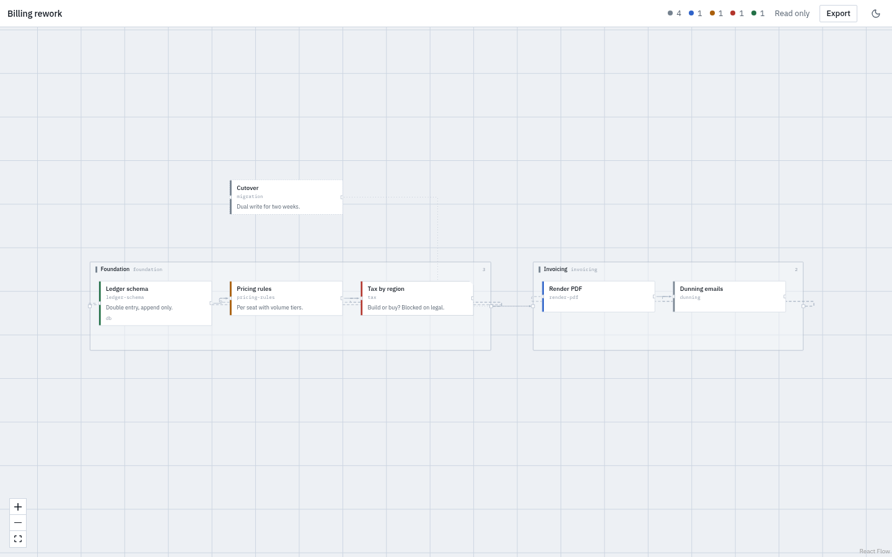
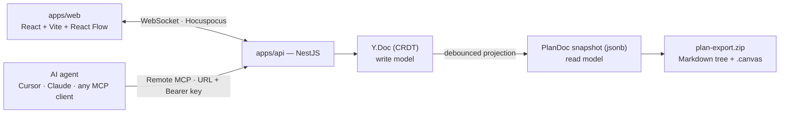

<div align="center">

# Schematic Planner

**Plan in the browser. Own the output.**

Turn a software idea into a visual plan graph — features, tasks and decisions on a
canvas — then take it with you as a plain Markdown tree and an Obsidian Canvas file.

[](./LICENSE)
[](#project-status)



</div>

---

## Table of contents

- [What this is](#what-this-is)
- [Who it is for](#who-it-is-for)
- [How it works](#how-it-works)
- [The data model](#the-data-model)
- [The MCP surface](#the-mcp-surface)
- [The export format](#the-export-format)
- [Repository layout](#repository-layout)
- [Where new code goes](#where-new-code-goes)
- [Performance notes](#performance-notes)
- [Getting started](#getting-started)
- [Conventions](#conventions)
- [Project status](#project-status)
- [Roadmap](#roadmap)
- [Non-goals](#non-goals)
- [Contributing](#contributing)
- [License](#license)

---

## What this is

AI coding agents are good at writing code and good at writing plans. They are bad at
holding a plan still. Ask one to build a feature and it will happily produce a
plausible task list, lose half of it three messages later, and reinvent the
architecture on the next run.

Schematic Planner is the step *before* the code. It gives a plan a **shape** — a graph
of features, tasks and decisions laid out on a coordinate plane — so that both the
human and the agent are looking at the same artifact. When the shape is agreed, the
plan leaves as files you can commit next to your source.

Two properties define the product:

1. **The output is yours.** Every plan exports to a directory tree of Markdown files
   plus an Obsidian Canvas, in a single zip. Nothing about the format needs this
   service to be readable. If we disappear, your plans still open.
2. **The whole server is yours if you want it.** The stack is AGPL-3.0 and runs from
   one Docker Compose file. No proprietary auth service, no managed-only dependency.

## Who it is for

| Audience | What they get |
|---|---|
| Solo developers doing AI-assisted ("vibe") coding | A durable plan an agent can read on every run instead of re-deriving it |
| Small product teams | A shared canvas for scoping, with real-time co-editing and share links |
| Obsidian / plain-text users | Plans that land in the vault as Markdown and Canvas, not in someone's database |
| Companies with source-code policies | A self-hostable instance behind their own network boundary |

## How it works

The web app and AI agents are **peer clients of the same document**. An agent adding a
task through MCP and a human dragging a node in the browser are writing to the same
place, at the same time, and both see the result immediately.



`apps/www` (Next.js) sits beside all of this and serves the landing page, docs, guides
and legal pages — everything that needs to be indexed by a search engine, and nothing
that needs to be interactive.

## The data model

This is the single most important thing to understand about the codebase.

Real-time collaboration and agent-driven writes cannot share one representation, so
there are two, and the direction between them never reverses:

```
Y.Doc (Yjs CRDT, stored as bytea)   ← the WRITE model.
                                      Human drags and MCP calls both land here.
        │  debounced projection
        ▼
PlanDoc snapshot (jsonb)            ← the READ model.
                                      Lists, search, share pages and export read this.
```

**Rules that follow from this, and must not be broken:**

- `packages/ydoc` is shared by `apps/web` and `apps/api`. Both sides bind the same
  document shape from the same code. If either side reimplements the shape, they will
  drift and corrupt documents.
- Nodes and edges live in **`Y.Map` keyed by id**, never in `Y.Array`. React Flow
  reorders its arrays freely; putting that on an array CRDT produces duplicates and
  lost nodes under concurrent editing.
- The snapshot is derived. Nothing writes to it directly. If you find yourself
  patching `jsonb`, you are in the wrong layer.
- Sync is served by **Hocuspocus embedded in the NestJS process** — same auth, same
  permissions, one container. Splitting it out is a scaling decision to make when load
  actually shows it, not before.

### Where things live

```
Workspace           people, roles, invitations, and the API keys agents connect with
  └─ Project        one thing being built
       └─ Plan      one graph
```

A workspace and a project are addressed by a readable slug; a plan is not, and
sits at the top level:

```
/                                  the site
/workspace/acme                    projects
/workspace/acme/project/billing    plans
/workspace/acme/members  /agents  /settings
/plan/:planId                      the canvas
/share/:token                      read only, no session
/settings                          your account
```

A plan link is the thing people paste to each other, so it stays flat: renaming
a workspace or a project must not break a link somebody saved. The cost is that
the canvas cannot tell where it sits from its own address, so it asks —
`GET /plans/:id/navigation` returns the workspace tree around a plan, names
only, and the canvas draws it as the rail you move between plans with.

### Plan vocabulary

`packages/schema` is the plan domain: the zod schemas every app imports, the graph
primitives built on them (containment tree, topological order, cycle detection),
the repair pass that turns arbitrary CRDT state back into a valid document, and
the pure reference implementation of the write path. A `PlanDoc` is:

- **nodes** — `feature`, `task`, `decision`, `note`, `group`. Each has a human-readable
  `slug`, a title, Markdown `body`, `status`, and an optional pinned `position`.
- **edges** — `contains` (nesting; becomes directory structure on export),
  `depends_on` (ordering; becomes file numbering on export), and `relates_to`
  (association with no structural meaning).

Edge identity is derived from its endpoints rather than generated, so submitting
the same relationship twice collapses to one edge instead of duplicating it. That
is what makes an agent's retry safe.

## The MCP surface

Agents are a first-class client, so the tool surface is designed around what an LLM is
actually good at. Three principles drive it:

**1. The agent never computes coordinates.** It declares structure; the server runs
ELK.js layout. A node without a `position` gets placed. A node a human has dragged is
`pinned` and auto-layout leaves it alone forever after.

**2. The agent speaks in slugs.** `auth-service`, not a UUID. An agent can create a
node and reference it in an edge in the same call, with no read-back round trip.

**3. There is one write door, and it is batched.** No `create_node`. A forty-node plan
is one call, applied inside a single `Y.transact`, so it appears on every open canvas
at once.

| Tool | Purpose |
|---|---|
| `list_workspaces()` | Workspaces the key can act in |
| `list_projects({ workspace? })` | Projects the key can reach, across the account or narrowed |
| `list_plans({ workspace? })` | Plans, grouped by workspace and project |
| `get_plan(id, { view })` | `view`: `outline` \| `graph` \| `markdown`. Positions and styling are excluded by default to keep responses small |
| `create_plan(spec)` | Whole structure in one shot — the path for "the agent already wrote a plan, now draw it". Takes a workspace and project slug; with one workspace reachable neither is needed, and with several it names them rather than guessing |
| `apply_ops(id, ops[])` | The only write door. Upsert by slug, so retries never duplicate |
| `layout(id, { scope })` | Re-run layout over everything that is not pinned |
| `export_plan(id)` | Markdown tree plus `.canvas` |

Authentication is a hosted Remote MCP endpoint: the user copies a URL and a Bearer key
from their settings page into any MCP client. Nothing to install, nothing to keep
updated, and a self-hosted instance simply hands out its own URL.

**A key belongs to a person, not a workspace.** Someone who works across several
should not have to issue, paste and revoke one per workspace, and an agent holding
such a key could not see the others exist. A key acts as its owner wherever they
are a member, which is why the tools take a workspace argument and the endpoint
lives under the account rather than a workspace.

Markdown is deliberately *not* parsed server-side. An agent converting its own prose
into the structured spec does a far better job than a parser guessing at headings.

## The export format

Containment edges become directory nesting. Dependency edges become a topological
order, which becomes the numeric filename prefix. A cycle does not block the export —
it is broken deterministically and reported as a warning.

```
plan-export.zip
├── README.md              overview and table of contents
├── 01-foundation/
│   ├── 01-database.md     frontmatter: id · status · depends_on
│   └── 02-auth.md
├── 02-editor/
│   └── 01-canvas.md
├── plan.canvas            Obsidian Canvas, original coordinates preserved
└── plan.json              machine-readable source of the same content
```

The whole transform is a pure function over a `PlanDoc`. It touches no database, no
filesystem and no network, which is why it is the most heavily tested part of the repo.

## Repository layout

pnpm workspaces, orchestrated by Turborepo.

```
apps/
  api/          NestJS + Prisma + Postgres
                auth · workspaces · projects · plans · sharing · API keys
                rate limiting · Hocuspocus sync gateway · Remote MCP endpoint
  web/          React + Vite + TypeScript — the application itself
                React Flow + shadcn/ui, client-side rendered
  www/          Next.js — landing, docs, guides, legal
                the SEO surface, and nothing else
packages/
  schema/       zod schemas, graph primitives, repair, and the pure write path.
                The shared vocabulary — everything else depends on it
  ydoc/         PlanDoc ⇄ Y.Doc bindings. Shared by web and api — must stay shared
  layout/       ELK.js auto-layout. Shared by the web "arrange" button and the MCP
                layout tool, so the two can never disagree
  exporter/     PlanDoc → directory tree → zip + .canvas. Pure, no I/O
deploy/         Caddyfile, the web image, and the production Compose file
tooling/        shared tsconfig and eslint configuration
```

Two module-format facts worth knowing before editing a build file:

- **`apps/api` is ESM**, because NestJS 12 ships ESM only. Its tsconfig uses
  `nodenext` and every relative import carries a `.js` extension.
- **The packages publish both**, ESM and CJS, through tsup. That costs nothing and
  keeps them usable from either side if a consumer ever needs CommonJS.

### Dependency direction

Dependencies flow one way. Nothing in `packages/` may import from `apps/`.

```
schema  ←  ydoc  ←  web, api
   ↖ layout   ←  web, api
   ↖ exporter ←  api
```

## Where new code goes

Use this order when deciding where something belongs:

1. **Is it a type or a validation rule?** → `packages/schema`
2. **Is it a pure transform over a plan?** → `packages/exporter` or `packages/layout`
3. **Does it change how the collaborative document is structured?** → `packages/ydoc`,
   and remember both clients now depend on it
4. **Is it an authorisation decision?** → `apps/api/src/workspaces/access.service.ts`,
   which is the only place that decides who may see what
5. **Does it need a database, a request, or a session?** → `apps/api`
6. **Is it something a person looks at and clicks?** → `apps/web`
7. **Does it need to be found by Google?** → `apps/www`

If a change seems to need code in both `apps/web` and `apps/api`, that is usually a
sign it belongs in a package instead.

## Performance notes

The canvas is the hard part. A plan of a few hundred nodes with live collaborators will
expose all three of these immediately:

- **Drag positions do not go into the document.** An in-flight drag is broadcast over
  the Yjs **Awareness** channel, which is ephemeral. Only `onNodeDragStop` commits to
  the `Y.Doc`. Without this, a single drag writes sixty CRDT updates per second,
  inflating document history and saturating the socket.
- **Subscribe to `Y.Map` changes per node, not per document.** Rebuilding the whole
  node array because one node moved makes React Flow re-render everything. A Zustand
  store swaps only the changed ids.
- **`nodeTypes` and `edgeTypes` are module-level constants.** Defining them inside a
  component remounts every node on every render. This is the most common and most
  destructive React Flow mistake.

On top of that: memoized custom node components, `onlyRenderVisibleElements` for large
graphs, and a level-of-detail switch that stops drawing node interiors below 0.55 zoom,
where they are unreadable anyway.

`packages/schema` and `apps/web` both carry tests for the identity rule — the store
test asserts that changing one node leaves every other node object `===` what it was.
It is the kind of property that silently regresses, so it is pinned down.

### One build, every environment

`apps/web` reads its API and collaboration URLs at runtime from `public/config.js`,
not from build-time Vite variables. One built bundle therefore runs anywhere: a
deployment replaces that one small file instead of rebuilding the application. The
dev server falls back to `VITE_API_URL` when the file leaves the values blank.

## Getting started

Requires Node 20+ and pnpm 9+ (developed on Node 26 / pnpm 11).

```bash
pnpm install

cp .env.example .env                       # then generate the two JWT secrets
docker compose up -d postgres              # local database

pnpm --filter @schematic/api db:deploy     # applies prisma/migrations
pnpm dev                                   # api, web and www together
```

The API is at `http://localhost:3001`, the app at `http://localhost:5173`, the
marketing site at `http://localhost:3000`.

### Deploying

```bash
cp .env.example .env       # set SITE_URL and the two JWT secrets
docker compose -f deploy/compose.yaml up -d --build
```

Three containers behind one address: Postgres, the API, and Caddy serving both
front ends and proxying `/api/*`. **One origin is a deliberate choice, not a
convenience** — it makes the session cookie same-site, which removes CORS and
cross-site cookie rules from the picture instead of configuring around them.
Migrations run to completion in their own container before the API starts.

| Script | Does |
|---|---|
| `pnpm dev` | All apps in watch mode |
| `pnpm build` | Full Turborepo build |
| `pnpm typecheck` | TypeScript across every workspace |
| `pnpm lint` | ESLint across every workspace |
| `pnpm test` | Vitest across every workspace |
| `pnpm check` | typecheck + lint + test — run this before you call something done |
| `pnpm --filter @schematic/api smoke` | End-to-end check against a running server |
| `pnpm --filter @schematic/web canvas-check` | Drives the canvas in a real browser |
| `pnpm --filter @schematic/api db:migrate` | Create a migration from a schema change |
| `pnpm --filter @schematic/api db:deploy` | Apply existing migrations |

There is no CI pipeline. `pnpm check` passing locally is the bar.

### The smoke check

`pnpm check` cannot see the seams — the websocket upgrade path, whether the sync
server is actually being fed frames, whether the CRDT reaches Postgres. Each of
those broke at least once during the first build and no unit test noticed, so
there is a script that exercises them against a running instance:

```bash
pnpm --filter @schematic/api smoke                      # against localhost:3001
SMOKE_API_URL=https://your-instance.example pnpm --filter @schematic/api smoke
```

It registers a throwaway account and leaves it behind, so point it at a
development instance. Run it after anything that touches collaboration,
authentication, or the MCP surface.

### The canvas check

The smoke check speaks the protocol, which is not enough. Three defects reached a
running server without a single test noticing: the canvas rendered nothing on a
shared link because its container had no height, containers were drawn on top of
their own children, and a container's handles sat behind the edge layer so a node
could not be dragged into a group at all. None of that is visible from the API.

```bash
CANVAS_CHECK_URL=http://127.0.0.1:8443 pnpm --filter @schematic/web canvas-check
```

It signs in, walks workspace to project to plan, and checks the things that
actually broke: that the canvas has height, that containers are drawn at their
own bounds, and that a container's handle can be reached rather than buried
behind the edges. Needs a Chromium on the machine (`CHROME_PATH` to point at
one) and a seeded plan to look at.

## Conventions

- **Everything written into this repository is in English.** Code, comments, commit
  messages, PR titles and bodies, test names, documentation. No exceptions.
- **Comments explain *why*, and only where a reader would otherwise be puzzled.** Do
  not narrate what the code already says. Sparse and load-bearing beats thorough.
- **Commits follow [Conventional Commits](https://www.conventionalcommits.org/)**:
  `feat(web): ...`, `fix(api): ...`, `refactor(exporter): ...`.
- **No AI attribution in git history.** No `Co-Authored-By` trailers for agents, no
  "generated with" banners in commit bodies or pull request descriptions. The human who
  opened the change is its author.
- **Pure packages are tested properly.** `schema`, `layout` and `exporter` have no
  excuse for thin coverage — they need no database and no network.
- **Never commit agent scratch files.** `.gitignore` already excludes them; see its
  header for the reasoning and the escape hatch.

## Project status

**Pre-alpha, and specific about what has been exercised.**

`pnpm check` runs 106 tests across 25 tasks. Beyond that the stack runs against a
real Postgres instance and is driven end to end by `pnpm --filter @schematic/api
smoke`, whose 42 assertions cover registration, the access-token guard, projects,
batched operations, rejection of an invalid batch, layout, the export zip, the
MCP surface behind a real key, share links, the permission boundary, workspace
and account management, throttling, and two live clients converging on one
document with their edits merging.

A browser check (`pnpm --filter @schematic/web canvas-check`) drives the canvas
itself, and every screen has been rendered and reviewed.

Running it for the first time is what found the real defects — the collaboration
socket was never fed frames so every client sat connected and silent; the canvas
rendered nothing on a shared link; containers were drawn on top of their own
children; a rejected batch answered 500; nodes added by an agent arrived
unplaced; the export was not reproducible. All fixed, all now covered.

Still missing:

- **Social sign-in is configured but not implemented.** `/auth/providers` reports
  which providers an instance holds credentials for; the callback routes are not
  written. Email and password work.
- **No email is ever sent.** An invitation produces a link you send yourself, and
  an email address cannot be changed because there is nothing to verify it with.
- **The containers have never been built.** Neither machine available here has a
  working container runtime. The Caddy arrangement itself is verified against a
  real Caddy — every route, and a sign-in whose cookie survives the proxy — but
  the images are not.
- **Rate limiting is per instance.** The counters live in memory, so several API
  instances each get their own allowance. A shared store is the fix when there is
  more than one.
- **The editor has had little real use.** It works and is covered at the protocol
  level, but nobody has sat and planned something substantial with it.

## Roadmap

- [x] The pure packages: schema, exporter, layout, ydoc
- [x] API, canvas, real-time collaboration, Remote MCP, export, sharing
- [x] Run it against a real database and fix what that finds
- [x] An end-to-end smoke check covering the seams unit tests cannot reach
- [x] Rate limiting on anything that answers a guess
- [x] Workspace > Project > Plan, with readable addresses
- [x] Member, invitation, workspace and account management
- [x] Connections that can be created, changed and removed on the canvas
- [x] One origin behind a reverse proxy, in containers
- [ ] Build and run the images
- [ ] GitHub and Google sign-in callbacks
- [ ] Email: invitations, address changes, password reset
- [ ] Import: read an exported bundle back into a plan (the exporter, reversed)
- [ ] Undo and redo on the canvas
- [ ] Plan version history and restore

## Non-goals

Deliberately out of scope, so nobody spends time proposing them:

- **Not an issue tracker.** Plans hand off to Jira, Linear or GitHub Issues; they do not
  replace them.
- **Not a general diagramming tool.** The graph carries plan semantics. If you want
  free-form boxes and arrows, use Excalidraw.
- **Not a code generator.** It produces the plan your agent reads. The agent writes the
  code.
- **No offline-first local application.** The server holds the document; portability is
  guaranteed by export and by self-hosting, not by running without a server.

## Contributing

1. Branch from `main`; do not commit to it directly.
2. Read [Conventions](#conventions) before your first commit — the English-only and
   no-AI-attribution rules are enforced in review.
3. Run `pnpm check` and make it pass.
4. Keep pull requests to one concern. A PR that reformats while it fixes is two PRs.

## License

Copyright © 2026 ruma.

Licensed under the [GNU Affero General Public License v3.0 or later](./LICENSE)
(`AGPL-3.0-only`).

AGPL was chosen on purpose. Anyone may run, modify and self-host this — including
commercially — but a modified version offered to others over a network must publish its
source. That keeps self-hosting a real promise rather than a marketing line.

---

<div align="center">

**Schematic Planner** · © 2026 ruma · AGPL-3.0-only

</div>
